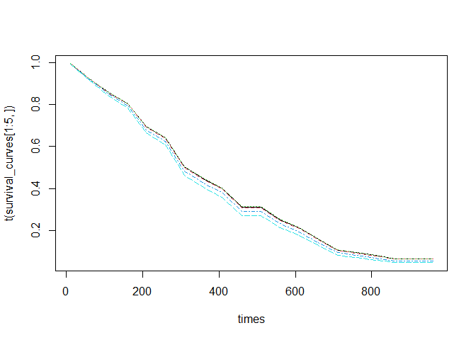

survXgboost package
================
Iyar Lin
18 juni, 2024

The xgboost package survival model returns predictions on the hazard
ratio scale (i.e., as
 in the proportional hazard function")h(t)
= h0(t) \* HR\$. This quantity is equivalent to the type = “risk” in
coxph. This package provides a thin wrapper that enables using the
xgboost package to perform full survival curve estimation.

See also
[discussion](https://datascience.stackexchange.com/questions/65266/how-do-i-predict-survival-curves-using-xgboost)
in stackoverflow

Below is a short usage demo.

First, prepare the data:

``` r
library(survXgboost)
library(survival)
library(xgboost)
data("lung")
lung <- lung[complete.cases(lung), ] # doesn't handle missing values at the moment
lung$status <- lung$status - 1 # format status variable correctly such that 1 is event/death and 0 is censored/alive
label <- ifelse(lung$status == 1, lung$time, -lung$time)

val_ind <- sample.int(nrow(lung), 0.1 * nrow(lung))
x_train <- as.matrix(lung[-val_ind, !names(lung) %in% c("time", "status")])
x_label <- label[-val_ind]
x_val <- xgb.DMatrix(as.matrix(lung[val_ind, !names(lung) %in% c("time", "status")]),
                     label = label[val_ind])
```

Below we train an xgboost survival model using the function from the
survXgboost package rather than the xgboost package:

``` r
# train surv_xgboost
surv_xgboost_model <- xgb.train.surv(
  params = list(
    objective = "survival:cox",
    eval_metric = "cox-nloglik",
    eta = 0.05 # larger eta leads to algorithm not converging, resulting in NaN predictions
  ), data = x_train, label = x_label,
  watchlist = list(val2 = x_val),
  nrounds = 1000, early_stopping_rounds = 30
)
```

    ## [1]  val2-cox-nloglik:1.986334 
    ## Will train until val2_cox_nloglik hasn't improved in 30 rounds.
    ## 
    ## [2]  val2-cox-nloglik:1.988136 
    ## [3]  val2-cox-nloglik:1.999648 
    ## [4]  val2-cox-nloglik:2.000725 
    ## [5]  val2-cox-nloglik:2.011412 
    ## [6]  val2-cox-nloglik:2.010582 
    ## [7]  val2-cox-nloglik:2.012655 
    ## [8]  val2-cox-nloglik:2.025819 
    ## [9]  val2-cox-nloglik:2.027110 
    ## [10] val2-cox-nloglik:2.027684 
    ## [11] val2-cox-nloglik:2.030564 
    ## [12] val2-cox-nloglik:2.034511 
    ## [13] val2-cox-nloglik:2.038002 
    ## [14] val2-cox-nloglik:2.043498 
    ## [15] val2-cox-nloglik:2.052795 
    ## [16] val2-cox-nloglik:2.057096 
    ## [17] val2-cox-nloglik:2.062697 
    ## [18] val2-cox-nloglik:2.074469 
    ## [19] val2-cox-nloglik:2.085677 
    ## [20] val2-cox-nloglik:2.084821 
    ## [21] val2-cox-nloglik:2.097534 
    ## [22] val2-cox-nloglik:2.102217 
    ## [23] val2-cox-nloglik:2.115933 
    ## [24] val2-cox-nloglik:2.123452 
    ## [25] val2-cox-nloglik:2.132746 
    ## [26] val2-cox-nloglik:2.137868 
    ## [27] val2-cox-nloglik:2.136174 
    ## [28] val2-cox-nloglik:2.140923 
    ## [29] val2-cox-nloglik:2.144434 
    ## [30] val2-cox-nloglik:2.149500 
    ## [31] val2-cox-nloglik:2.153794 
    ## Stopping. Best iteration:
    ## [1]  val2-cox-nloglik:1.986334

Next we can predict full survival curves:

``` r
# predict survival curves
times <- seq(10, 1000, 50)
survival_curves <- predict(object = surv_xgboost_model, newdata = x_train, type = "surv", times = times)
matplot(times, t(survival_curves[1:5, ]), type = "l")
```

<!-- -->

We can also predict the risk scores like in the original xgboost
package:

``` r
# predict risk score
risk_scores <- predict(object = surv_xgboost_model, newdata = x_train, type = "risk")
hist(risk_scores)
```

<!-- -->

We can see the package can produce survival estimates that are well
calibrated

``` r
if(require(riskRegression)){
  data(cancer, package="survival")
  status_mgus2 <- ifelse(mgus2$death == 0, -mgus2$futime, mgus2$futime)
  # We use na.pass since XGBoost can predict for missing data
  formula_mgus2 <-  ~ age + sex + dxyr + hgb + mspike - 1
  x_mgus2 <- model.matrix(
    formula_mgus2,
    model.frame(formula_mgus2, mgus2, na.action = "na.pass")
  )
  # Note: this model is likely overfitting horribly, but that helps demonstrate calibration
  mgus2_model <- xgb.train.surv(
    params = list(
      objective = "survival:cox",
      eval_metric = "cox-nloglik",
      eta = 0.2
    ), data = x_mgus2, label = status_mgus2,
    nrounds = 10
  )
  surv_predictions <- predict(mgus2_model, x_mgus2, type = "surv", times= 60)
  score <- Score(list(model1=1-surv_predictions),Surv(futime,death) ~1 ,data=mgus2,
           times=60,plots="cal")
  plotCalibration(score, rug = TRUE)
}
```

<!-- -->
